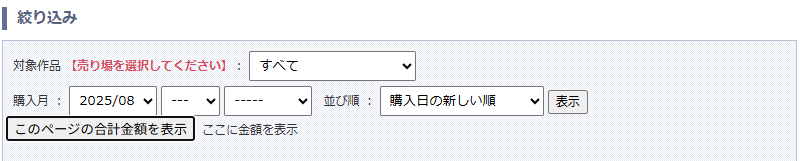

# Chrome拡張機能「DLSite Buy History Total Price」

## 概要
このプロジェクトは、DLsiteの購入履歴ページで動作するChrome拡張機能です。  
表示した購入履歴から合計金額を表示するボタンとテキストを画面上に追加します。


## ディレクトリ構成
```
chrome_ad/
├── src/
│   ├── content.ts      # 拡張機能のメインスクリプト（TypeScript）
│   └── manifest.json   # Chrome拡張機能の設定ファイル
├── dist/               # ビルド後の出力先
│   ├── content.js      # コンパイル済みJavaScript
│   └── manifest.json   # 設定ファイル（コピー）
├── package.json        # npmスクリプト・依存管理
├── tsconfig.json       # TypeScript設定
```

## セットアップ方法
1. 依存パッケージのインストール
   ```
   npm install
   ```
2. ビルド
   ```
   npm run build
   ```
   - `dist/`フォルダに`content.js`と`manifest.json`が生成されます。

## Chrome拡張機能として読み込む方法
1. Chromeで `chrome://extensions/` を開く
2. 「デベロッパーモード」をON
3. 「パッケージ化されていない拡張機能を読み込む」から `dist/` フォルダを選択

## 主な機能
- ページ内のテーブルからデータ抽出
- ボタン追加・クリックイベント処理

## ダウンロード方法
1. [Releasesページ](https://github.com/taktak7890/dlsite-buy-history-total-price/releases) から最新版のzipファイルをダウンロードしてください。
2. zipファイルを解凍し、解凍したフォルダの中身（`content.js`, `manifest.json`）をChrome拡張機能の「パッケージ化されていない拡張機能を読み込む」から指定してください。

## 開発者向け
- ソースコードは`src/`にあります。
- ビルドにはNode.jsとnpmが必要です。
- `npm install` → `npm run build` で`dist/`に成果物が生成されます。
